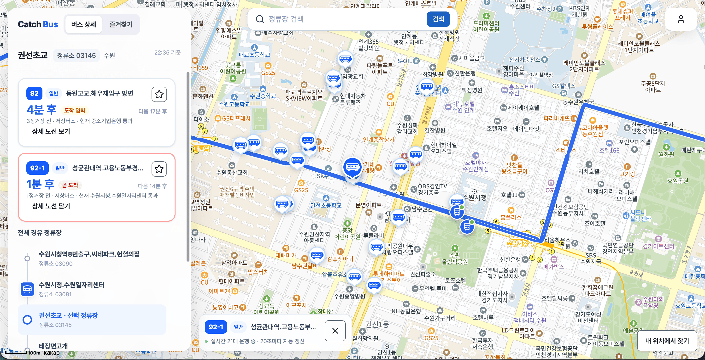
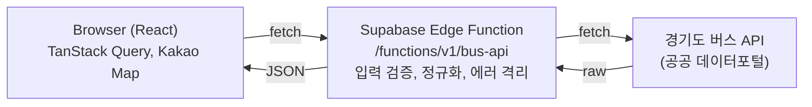

# 🚌 Catch Bus

[](https://github.com/nayeonkim910/catch-bus/actions/workflows/ci.yml)

> 자주 타는 버스 노선과 승차 정류장 조합의 실시간 도착 상황을, 집을 나서기 전에 한눈에 확인하는 웹 서비스

경기도 공공 버스 API를 기반으로, 지도에서 주변 정류장을 찾고 도착 정보를 확인하고 노선의 실시간 차량 위치를 추적하고 자주 쓰는 조합을 즐겨찾기할 수 있습니다.

🔗 **Live Demo:** [내버스.com](https://www.xn--220b17to0e.com/)

**개발 기간:** 2026.07 ~ 진행 중 (1인 개발)



## 주요 기능

- 주변 정류장 지도: 현재 위치와 지도 이동에 따라 주변 정류장을 Kakao 지도 위 마커로 표시
- 정류장 검색과 도착 정보: 정류장을 검색/선택하면 노선별 도착 예정 시간과 남은 정거장 수를 조회
- 노선 실시간 추적: 노선을 선택하면 지도에 노선 형상(폴리라인)과 실시간 차량 위치를 20초 주기로 갱신
- 진행선 시각화: 선택한 버스가 목적 정류장까지 몇 정거장 남았는지 좌표 기반 진행선으로 표현
- 즐겨찾기: 노선과 정류장 조합 단위로 저장하고, 각 즐겨찾기의 도착 정보를 독립적으로 확인

## 기술 스택

| 영역 | 사용 기술 |
| --- | --- |
| Core | React 19, TypeScript, Vite |
| 서버 상태 | TanStack Query |
| 클라이언트 상태 | Zustand + persist (즐겨찾기 localStorage 영속화) |
| 스타일링 | Tailwind CSS v4, CVA(class-variance-authority) |
| UI 프리미티브 | Radix UI (Dialog, Tabs), vaul(모바일 바텀시트), lucide-react |
| 지도 | Kakao Maps SDK |
| 백엔드 | Supabase Edge Functions (Deno), 공공 API 프록시 |
| 테스트 | Vitest, React Testing Library (프론트) / Deno test (엣지 함수) |
| 품질 | ESLint, Prettier, GitHub Actions CI |

## 아키텍처

공공 API를 클라이언트에서 직접 호출하지 않고, Supabase 엣지 함수를 프록시로 두는 구조입니다.



이렇게 둔 이유:

- API 키 은닉: 공공 API 인증키를 클라이언트에 노출하지 않음
- 신뢰 경계 분리: 형식이 제각각인 공공 API 원본을 엣지 함수에서 검증/정규화해, 프론트는 일정한 형태의 데이터만 소비
- 응답 형식 통일: 엣지 함수가 응답을 `{ data, meta }` 규격으로 감싸 클라이언트 처리를 단순화

## 설계 결정

**1. 데이터 성격별 캐시 전략** ([`src/lib/busQueries.ts`](src/lib/busQueries.ts))

도착 정보(30초), 실시간 차량 위치(10초), 노선 형상/경유 정류장(24시간)처럼 갱신 주기가 다른 데이터에 서로 다른 `staleTime`을 부여했습니다. 여러 즐겨찾기가 같은 정류장을 참조할 때는 `stationId`로 중복을 제거하고 `queryKey`를 공유해, 정류장당 한 번만 도착 정보를 조회합니다.

**2. 정류장 전환 시 오래된 요청 취소** ([`src/features/search/useStationSearch.ts`](src/features/search/useStationSearch.ts), [`src/lib/busQueries.ts`](src/lib/busQueries.ts))

정류장·검색어마다 `queryKey`가 분리돼, 늦게 도착한 이전 요청의 응답은 자기 캐시에 들어갈 뿐 현재 화면을 덮어쓰지 않습니다. 여기에 더해 전환 시 `signal`(AbortController)로 불필요해진 in-flight 요청을 취소해, 네트워크와 공공 API 호출 한도 낭비를 줄였습니다.

**3. 폴링 자원 관리** ([`src/features/map/useBusLocations.ts`](src/features/map/useBusLocations.ts))

실시간 차량 위치는 20초 주기로 폴링하되, `refetchIntervalInBackground: false`로 탭이 백그라운드일 때는 폴링을 멈춰 불필요한 호출과 공공 API 호출 한도 낭비를 막았습니다.

**4. 외부 API 방어적 처리** ([`supabase/functions/bus-api/gyeonggi/normalize.ts`](supabase/functions/bus-api/gyeonggi/normalize.ts))

공공 API 응답을 그대로 믿지 않고 필드 단위로 검증(`requireString`/`requireStringOrNumber`/`requireNumber`)한 뒤, 이상값이면 `502 UPSTREAM_ERROR`로 격리해 깨진 데이터가 화면까지 전파되지 않도록 했습니다.

**5. 런타임에 맞춘 테스트 전략** ([`useFavoriteArrivals.test.ts`](src/features/favorites/useFavoriteArrivals.test.ts), [`normalize.test.ts`](supabase/functions/bus-api/gyeonggi/normalize.test.ts))

커버리지를 채우기보다 회귀 위험이 큰 핵심 로직만 골라 테스트했습니다. 프론트엔드는 Vitest + React Testing Library, 엣지 함수는 Deno 내장 러너로 각 런타임에 맞게 분리했고, GitHub Actions에서 PR마다 lint·타입 체크·양쪽 테스트를 자동으로 검증합니다.

## 데모 안내

- **지원 범위:** 현재 경기도 버스 데이터만 지원합니다. 앱은 기본적으로 경기 지역 지도로 열리며, 서울 등 타 지역의 정류장은 검색/조회되지 않습니다.
- **로그인:** 로그인 없이 게스트 상태로 모든 핵심 기능(정류장 검색, 도착 정보, 실시간 추적, 즐겨찾기)을 사용할 수 있습니다. 소셜 로그인(카카오/구글)은 UI만 구현되어 있고, 계정 연동과 기기 간 동기화는 추후 지원 예정입니다.
- **위치:** 위치 권한을 거부해도 기본 지역(경기) 지도로 정상 동작하며, "현재 위치" 기반 주변 정류장 조회만 비활성화됩니다.

## 로컬 실행

요구 사항: Node.js 20+ (`.nvmrc` 기준 24), [Kakao Developers](https://developers.kakao.com/) JavaScript 키, Supabase 프로젝트

```bash
# 1. 의존성 설치
npm install

# 2. 환경 변수 설정
cp .env.example .env.local   # 아래 값 채우기

# 3. 개발 서버 실행
npm run dev
```

`.env.local`:

```env
VITE_SUPABASE_URL=<Supabase 프로젝트 URL>
VITE_SUPABASE_PUBLISHABLE_KEY=<Supabase publishable key>
VITE_KAKAO_MAP_JAVASCRIPT_KEY=<Kakao Maps JavaScript 키>
```

주요 스크립트:

```bash
npm run dev            # 개발 서버
npm run build          # 타입 체크(tsc -b) + 프로덕션 빌드
npm run lint           # ESLint
npm run format         # Prettier
npm run test           # Vitest (watch 모드)
npm run test:run       # Vitest 1회 실행
npm run test:edge      # Deno 엣지 함수 테스트
npm run test:all       # 프론트 + 엣지 전체 테스트
```

## 폴더 구조

```
src/
├─ features/          # 도메인별 기능 (map, details, favorites, selection 등)
├─ shared/            # 공용 컴포넌트, 유틸, 타입 (ui 프리미티브, cn, 진행선 등)
├─ lib/               # API 클라이언트(busApi), Query 옵션(busQueries)
├─ app/               # 앱 전역 provider (QueryProvider)
└─ test/              # 테스트 설정·픽스처 (Vitest)

supabase/functions/bus-api/   # 공공 API 프록시 엣지 함수 (Deno)
└─ gyeonggi/                   # 경기도 버스 API 연동, 정규화, 테스트
```
